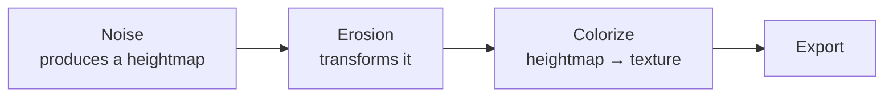
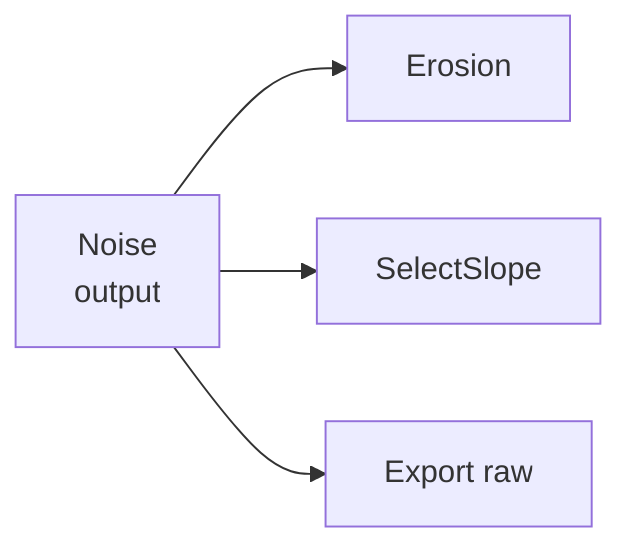

# How Data Is Processed

## The idea

A graph is a pipeline. A value is **produced** by one node, **read** by the nodes
wired to it, **transformed** into new values, and passed on — again and again —
until it reaches an `Export` node. This page follows that journey: how a value moves
from node to node, what happens when a wire **splits**, and why the *kind* of data on
a wire changes what a receiving node can do with it.

It helps to read [Ports & data flow](ports.md) first — that page covers the wires
themselves. This one is about what travels along them.

## Passing data from node to node

Each node does three things in turn: it **reads** whatever is on its inputs,
**computes** a result, and **writes** that result to its outputs. The next node
downstream then reads *that* and does the same. Nothing travels until a node computes;
what flows is the finished result sitting on an output, waiting to be read.

A node only ever writes to its **own** outputs. It reads its inputs but leaves them
as it found them, so the node that produced a value keeps owning it. This is what
makes the pipeline predictable: a value is created in exactly one place and everything
downstream reads from that one place.

Hesiod runs the nodes in **dependency order** — a node computes only once the nodes
feeding it have already computed, so its inputs are always ready. Change a parameter
and only the nodes *downstream* of the change recompute; everything upstream is
already correct and is left alone.

## Splitting a wire

You can drag more than one wire out of a single output. When you do, the output is
**not** duplicated or divided — every downstream node reads the *same* result.

Here the same noise heightmap is read three times. `Erosion`, `SelectSlope` and
`Export` each receive an identical copy of it, and because each node writes only its
own output, none of them can disturb what the others see. After the split the three
branches are **independent** — each transforms its copy however it likes, and they go
their separate ways.

Branches only come back together at a node that takes **two or more inputs** — a
`Blend` mixing two heightmaps, a `MergeWaterDepths` adding two water layers, a
`SetAlpha` fitting a mask onto a texture. That is the only place separate branches
recombine; everywhere else, a split stays split.

## The kind of data decides what happens on arrival

Not every wire carries a heightmap. Hesiod moves several kinds of data, and a
receiving node treats each differently — this is the heart of what "processing" means.
The kind of data is fixed by the output that produced it, and a node will only accept
a wire of a kind it knows how to handle.

### Heightmaps — the workhorse

Most wires carry a **heightmap** (`VirtualArray`): a full grid of elevation values.
Nodes read a grid in and write a grid out, cell by cell. This is the default flow —
noise, erosion, filters, math all pass heightmaps along, transforming the whole grid
at each step.

### Water depth — the same grid, a different meaning

Water depth travels on the *same kind of grid* as a heightmap, but it does **not**
mean elevation — it means *how deep the water is* at each cell, a second layer sitting
on top of the land. Because it looks like any other heightmap on the wire, the **port
name** is what tells you its role: a port called `water_depth` is asking for that
water layer, not for terrain.

Nodes that receive it read it *as* water: `WaterElevationFromDepth` adds the depth to
the land to get the water surface, `MergeWaterDepths` sums two water layers,
`WaterMask` turns depth into a selector for "where is there water". Feed a water-depth
port an ordinary heightmap and it will run — but the numbers mean the wrong thing, so
the result will be nonsense. Matching *roles*, not just types, is on you.

### Paths and clouds — geometry, not a grid

A **path** (`Path`) is an ordered chain of points — a curve, a river course, a ridge
line. A **cloud** (`Cloud`) is a scattered set of points. Neither is a grid, so a
heightmap node **cannot receive one directly** — the wire simply won't connect.

To make geometry affect the terrain you pass it through a **converter** that turns it
into a heightmap: `PathToHeightmap` rasterises a curve, `PathDig` carves it into an
existing surface, `IslandChain` grows land along it, `CloudToArrayInterp` spreads
scattered points into a smooth field. Until you convert it, geometry stays geometric —
`PathSmooth` and `PathFractalize` reshape the *curve itself* and hand back another
path. So a path's journey is usually: build and edit it as geometry, then convert it
to a heightmap at the point where it should become landscape.

### Textures — the colour end

A **texture** (`VirtualTexture`) is an RGBA colour image. It appears when a
**colouriser** (`ColorizeGradient`, `HeightmapToRGBA`) reads a heightmap and produces
colour. From there textures flow through their own nodes — compositing, alpha, normal
maps — down to `Export`. A texture cannot go back into a node expecting a heightmap
unless you explicitly convert it (`NormalMapToHeightmap`).

## See also

- [Ports & data flow](ports.md) — the wires, and how inputs read from outputs.
- [Heightmaps & virtual arrays](heightmaps.md) — the main data type in detail.
- [Masks & selectors](masks-selectors.md) — building the masks that scope operations.
- [Node reference](../node_reference/categories.md) — every node's inputs and outputs.
