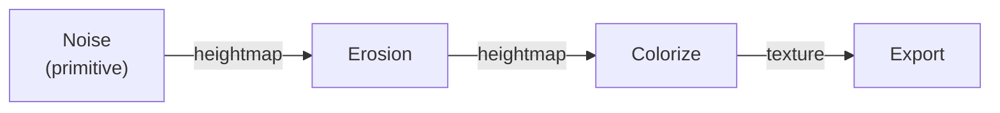

# Heightmaps & Virtual Arrays

## The idea

A **heightmap** is a grayscale image of elevation: a 2-D grid where each cell holds
a height value. Brighter = higher. Most nodes in Hesiod take one or more heightmaps
in and produce a heightmap out — that is the data flowing along the wires in a graph.
A few nodes convert to other types: a **colouriser**, for example, takes a heightmap
in and produces a *texture* (an RGBA image) out.

Most wires carry a heightmap from one node to the next; the colouriser is where the
data turns into a texture. Matching wire types matters — you cannot feed a texture
into a node that expects a heightmap.

Heights live in a **normalized** range and the terrain lives in a **unit square**
(`[0,1] × [0,1]`); real-world scale is applied only at export. This is why the same
graph behaves the same at any resolution. (Details:
[Coordinate system](../user_manual/coordinate_system/index.md).)

## How Hesiod handles it

In the node reference you will see ports typed **`VirtualArray`** (the `Inputs` and
`Outputs` tables). A *virtual array* is Hesiod's representation of a heightmap —
the value that flows along the wire from the node that produces it to the node
that consumes it.

## See also

- [Ports & data flow](ports.md) — how these values travel between nodes.
- [Node reference](../node_reference/categories.md) — every node's input/output heightmap ports.
- [Tiling & overlap](tiling-overlap.md) — how a heightmap is computed in pieces.
- [Coordinate system](../user_manual/coordinate_system/index.md) — the normalized domain.
