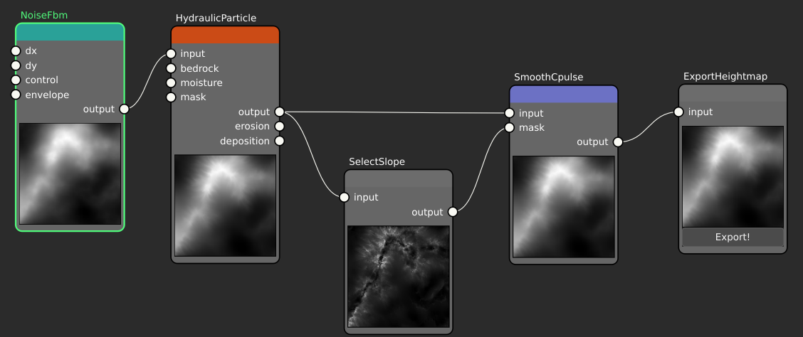

# Masks & Selectors

## The idea

Often you want an operation to apply to *part* of the terrain — roughen only the
steep faces, tint only the low ground, erode only the valleys. A **mask** expresses
that: it is itself a heightmap, used as a per-cell weight. Typically `1` means "fully
apply here", `0` means "leave untouched", and values in between blend.

A **selector** is a node that *builds* a mask by looking at a property of the
terrain — slope, elevation, curvature, distance — and emitting high values where
the property matches. Hesiod's selector nodes are the `Select…` family
(`SelectSlope`, `SelectGt`, `SelectInterval`, `SelectRivers`, `SelectValley`, …),
and masks can be combined with `CombineMask`.

## How Hesiod handles it

A selector takes a heightmap on its `input` port and returns a heightmap on its
`output` port, which you feed into another node's mask input. Because a mask is just
a heightmap, anything that makes a heightmap can be a mask, and masks compose.

Here the eroded terrain feeds `SelectSlope`, whose thumbnail shows the resulting
**mask** — bright on the steep faces, dark on the flats. That mask is wired into the
`mask` input of a `SmoothCpulse` filter, while the same terrain also feeds the
filter's `input`, so the filter only acts where the mask is high.

`CombineMask` takes two heightmaps and merges them — intersection (per-cell minimum),
union (per-cell maximum), or exclusion (the difference) — so you can build up
"steep *and* high" or "valley *or* river" regions from simpler selectors.

## See also

- [Node reference → selector nodes](../node_reference/categories.md) — the full `Select…` family.
- [Heightmaps & virtual arrays](heightmaps.md) — a mask *is* a heightmap.
