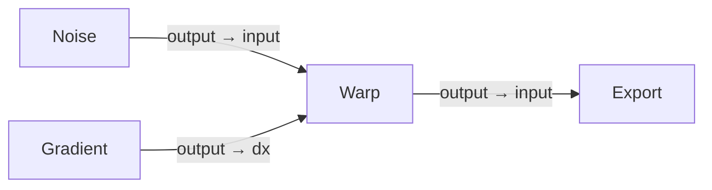
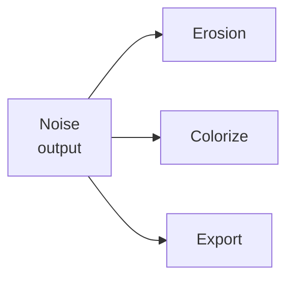

# Ports & Data Flow

## The idea

Every node has **ports** — the small dots on its edges where wires attach. Ports on
the left are **inputs** (data coming in); ports on the right are **outputs** (data
going out). A wire always runs from one node's output to another node's input, and
what travels along it is whatever that output produced: a heightmap, a texture, a
path, a cloud of points.

Here `Warp` takes a heightmap on its `input` port and a second heightmap on its `dx`
port, and produces a warped heightmap on its `output`. Each wire carries one value
from the port that made it to the port that needs it.

## How a port transmits data

An **output port owns the data it produces**. When a node computes, it writes its
result into its own output ports and holds onto it there. That value stays put until
the node next recomputes.

Because the output *holds* the data, one output can feed **any number of inputs** at
once. You can drag a second, third, tenth wire out of the same output port and every
downstream node reads the very same result — Hesiod does not copy the heightmap once
per wire. Fanning an output out to many nodes is free.

## How a port receives data

An **input port does not own anything** — it is a *reference* to the output it is
wired to. When a node needs its input, it reads straight from the upstream output's
stored value. Nothing is copied on the way in; the consumer reads the exact data the
producer wrote.

This has one consequence worth understanding, because it explains a lot of node
behaviour:

> **An input with no wire has nothing to read.** It is a reference pointing at
> nothing, so the node sees *"no data here"* rather than a blank heightmap.

Many nodes are built around exactly that. Ports like `dx`, `dy`, `mask`, `envelope`
and `control` are **optional**: wire one up and the node uses it; leave it empty and
the node simply skips that part of its work. A `Warp` with nothing on `dx`/`dy` does
no warping; a filter with nothing on `mask` applies everywhere instead of being
scoped. You do not need to connect every input — only the ones whose effect you want.

## Matching ports: type and direction

Two rules decide whether a wire is allowed at all, and Hesiod enforces both:

- **Direction** — a wire must go from an **output** to an **input**. You cannot join
  two outputs or two inputs.
- **Type** — the two ports must carry the **same kind of data**. A `VirtualArray`
  (heightmap) output will not connect to a port expecting a `Path` or a
  `VirtualTexture`. The colours and shapes of the port dots reflect this; a wire that
  would break either rule is refused rather than silently carrying nothing.

This is also what powers **[drag-to-create](../node_reference/categories.md)**: when
you drag a wire out of a port and drop it on empty canvas, Hesiod offers only the
nodes that have a port of a compatible type and direction to receive it.

## When data actually flows

Hesiod does not recompute everything on every change. When a node's parameters or
inputs change, it works out which nodes sit **downstream** of it — the ones whose
results depend on it — and recomputes just those, in dependency order, so each node's
inputs are ready before it runs. A change near the end of a graph is cheap; a change
at the very start ripples through everything after it. Nodes that are not downstream
of the change are left exactly as they were.

Ports are only half the story: they carry the data, but what *happens* to it — how a
value travels the graph, what a split means, and why a heightmap, a water-depth field
and a path are each handled differently on arrival — is covered in
**[How data is processed](data-processing.md)**.

## Common ports

Most ports are named for their role, and the same names recur across many nodes with
the same meaning. The table below covers the ones you will meet most often. Each
node's own page in the [Node Reference](../node_reference/categories.md) lists its
exact ports and is always the authoritative source.

| Port | Data type | Direction | What it carries |
| :--- | :--- | :--- | :--- |
| `input` | VirtualArray | in | The main heightmap the node operates on. |
| `output` / `out` | VirtualArray | out | The node's result heightmap. |
| `dx` | VirtualArray | in *(optional)* | Horizontal displacement, as a fraction of the domain — pushes pixels sideways. |
| `dy` | VirtualArray | in *(optional)* | Vertical displacement, as a fraction of the domain. |
| `dr` | VirtualArray | in *(optional)* | Displacement along the normal (radial) direction. |
| `mask` | VirtualArray | in *(optional)* | Per-cell weight in `[0, 1]` scoping *where* the operation applies. |
| `envelope` | VirtualArray | in *(optional)* | Amplitude multiplier shaping the overall result, applied as a post-process. |
| `control` | VirtualArray | in *(optional)* | A field that modulates the node's strength cell by cell. |
| `elevation` | VirtualArray | in | An elevation field the node reads (e.g. to place or weight features). |
| `noise` | VirtualArray | in *(optional)* | A heightmap injected as a noise/perturbation source. |
| `water_depth` | VirtualArray | out | Depth of water over flooded areas. |
| `path` | Path | in / out | An ordered set of connected points (a curve or route). |
| `cloud` | Cloud | in / out | A set of scattered points `(x, y)` with elevations `z`. |
| `texture` | VirtualTexture | in / out | An RGBA colour image, as produced by a colouriser. |
| `kernel` | Array | in / out | A small convolution kernel (a weighting stencil). |

See [Heightmaps & virtual arrays](heightmaps.md) for what `VirtualArray` and the
other data types mean.

## See also

- [How data is processed](data-processing.md) — the journey of a value through the
  graph, and how each kind of data behaves when a node receives it.
- [Heightmaps & virtual arrays](heightmaps.md) — the data types that flow through ports.
- [Masks & selectors](masks-selectors.md) — how the `mask` input scopes an operation.
- [Node reference](../node_reference/categories.md) — every node's exact ports.
- [Glossary](glossary.md) — quick definitions.
