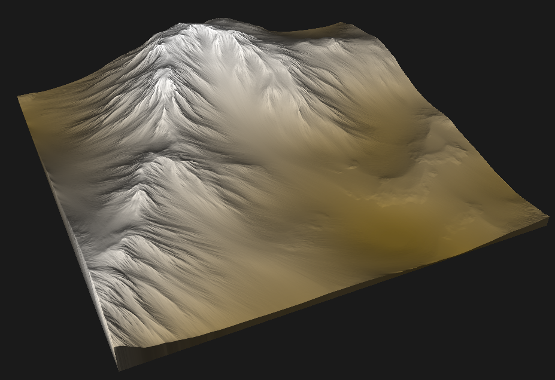
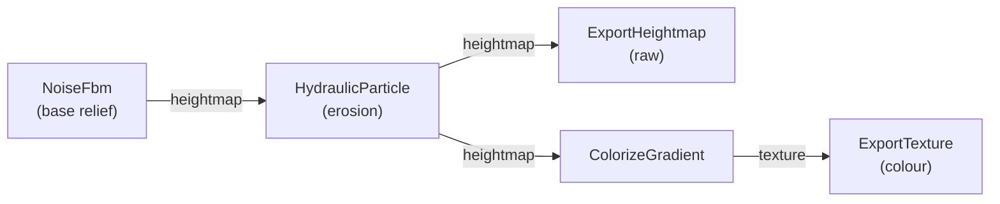
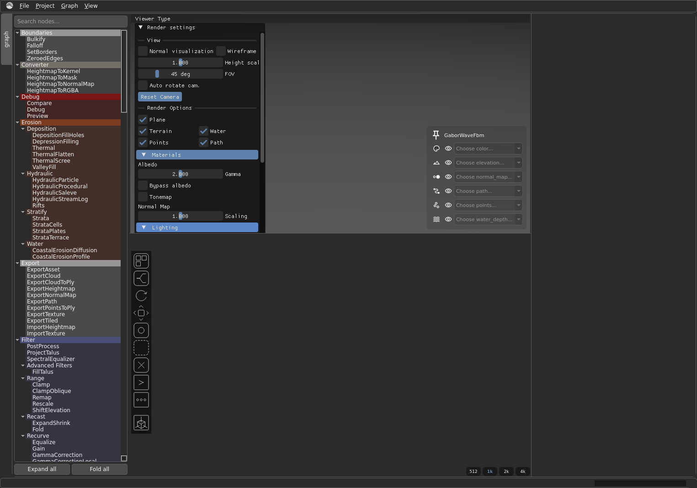
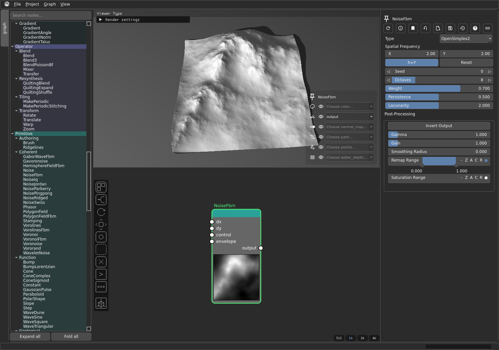
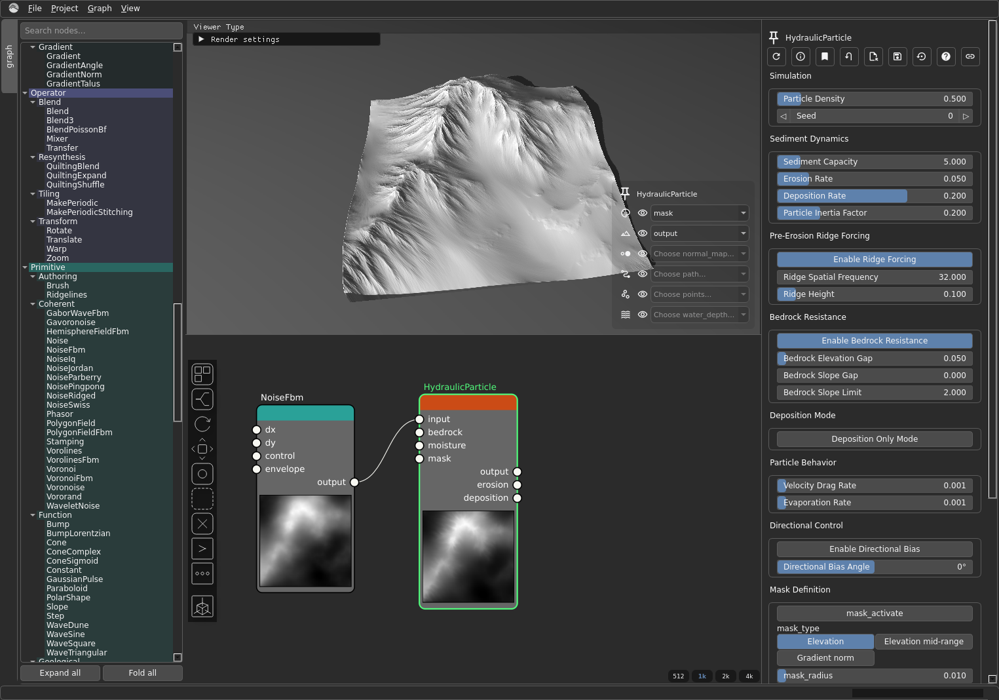
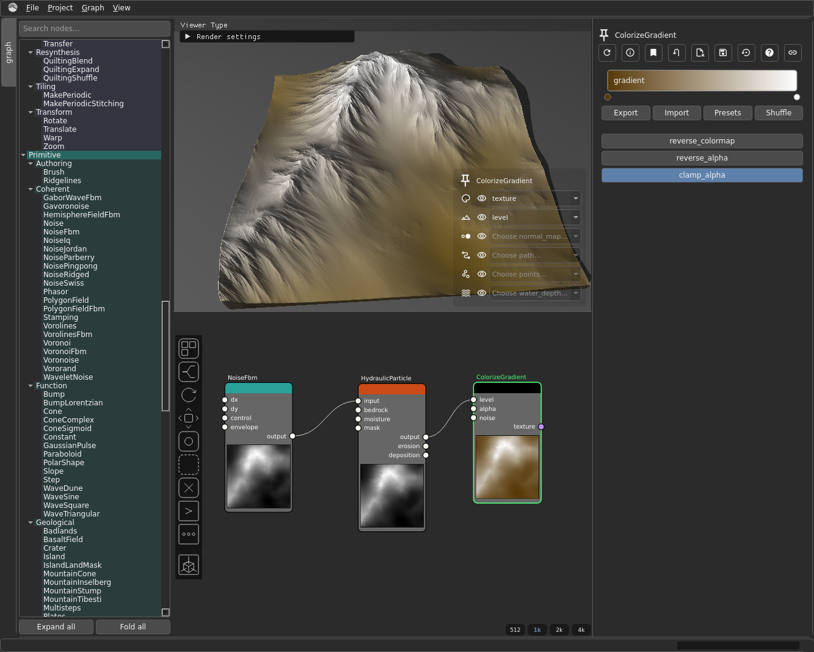
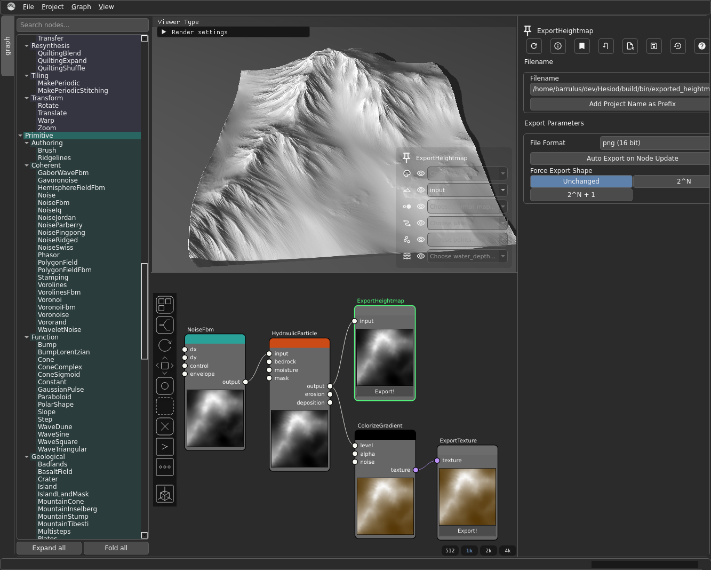

# Your First Terrain

This is a hands-on walkthrough: open Hesiod, wire up a small graph, and get a real
terrain out the other end — a raw heightmap for your engine and a coloured map to
look at. It is the *do this first* page. If you want the *why* behind the ideas
below, read [Core Concepts](../core_concepts/index.md) first; this page is the *how*.

Every step below is a real action in the app. The node names, ports, and parameters
are exactly what you will see on screen.

## What you'll build

One short graph. The shape looks linear at first, but it **forks** at the end: the
eroded heightmap feeds *two* outputs — a raw export and a coloured one.

The fork is the one thing newcomers trip over, so it is worth saying plainly: the raw
heightmap export branches off **before** the colouriser, because exporting a
heightmap and colouring a heightmap are two different things done to the *same* data.
More on that at [Step 4](#step-4-export-both-outputs).

## Open Hesiod

When Hesiod opens you are looking at three things:

- the **node graph** in the centre, where you build the graph;
- the **3D viewport**, where the terrain is rendered;
- the **resolution selector**, which controls how finely the terrain is computed.

To add a node, open the node library and pick one, or right-click in the graph. Nodes
are grouped by category — the categories in parentheses below tell you where to find
each one.

## Step 1 — A base heightmap (`NoiseFbm`)

Add a **`NoiseFbm`** node (category *Primitive/Coherent*). This is your starting
relief: fractal noise that already looks vaguely landscape-like.

The three knobs worth playing with first:

- **`seed`** — change it to get a completely different landscape.
- **`kw`** — the wavenumber, i.e. the base feature size. Lower is broader hills;
  higher is busier terrain.
- **`octaves`** — how many layers of detail are stacked on top. More octaves = more
  fine detail.

*Why:* fractal noise gives natural-looking base relief to build on. On its own it is
not yet terrain — that comes next.

!!! tip "Reading the previews"
    Each node shows a small **preview thumbnail** in its body — a live grayscale (or
    colour) picture of what that node currently produces. It refreshes as you change
    settings, so you can dial in a parameter and watch the result. If a preview ever
    looks stale, the node's settings toolbar has a **Force Update** button that
    recomputes it. See the
    [node settings toolbar](../user_manual/node_settings/node_settings_management.md)
    for the full set of buttons.

## Step 2 — Erode it (`HydraulicParticle`)

Add a **`HydraulicParticle`** node (category *Erosion/Hydraulic*) and wire
`NoiseFbm`'s **`output`** into the erosion node's **`input`**. Erosion is what makes
noise read as terrain: it carves valleys and channels and deposits sediment, so the
relief stops looking like noise and starts looking like a place.

`HydraulicParticle` has several outputs (`output`, `erosion`, `deposition`); for this
walkthrough you only need **`output`** — the eroded heightmap. That single output
port is what feeds *both* branches of the fork.

*Why:* erosion is the step that turns generic noise into believable landforms.

## Step 3 — Colour by elevation (`ColorizeGradient`)

Add a **`ColorizeGradient`** node (category *Texture*). Wire the **eroded heightmap**
— `HydraulicParticle`'s `output` — into the colouriser's **`level`** input, then pick
a **`gradient`** (the colormap) to map elevation to colour.

!!! warning "The data type changes here"
    Everything up to this point has been a **heightmap** (`VirtualArray` in the node
    reference). `ColorizeGradient` takes a heightmap in and emits a **texture**
    (`VirtualTexture`) out — an RGBA image. This is where you leave heightmap-land for
    colour-land, and it is why the texture export hangs off `ColorizeGradient` while
    the raw export does **not**: a texture cannot be fed into a node that expects a
    heightmap. See [Heightmaps & virtual arrays](../core_concepts/heightmaps.md).

*Why:* colour turns the grayscale elevation field into a map you can actually read.

## Step 4 — Export both outputs

Now the graph forks. You want **two** files: the raw heightmap for your engine, and
the coloured map for reference. They come from two different points in the graph.

- **`ExportHeightmap`** (category *Export*) ← wire **`HydraulicParticle`'s `output`**
  into its **`input`**. This is the raw, engine-ready elevation. Because it needs a
  heightmap (`VirtualArray`), it must branch off the eroded heightmap **before**
  `ColorizeGradient`, not after it.
- **`ExportTexture`** (category *Export*) ← wire **`ColorizeGradient`'s `texture`**
  output into its **`texture`** input. This is the coloured map.

A single output port can drive **multiple** wires — that is how `HydraulicParticle`'s
`output` feeds both `ExportHeightmap` and `ColorizeGradient` at once. Drag a second
wire out of the same port to make the second connection.

On each export node, set the file name in **`fname`**. `ExportHeightmap` also lets you
choose a **`format`**; `ExportTexture` has a **`16 bit`** toggle for higher colour
depth. Both have an **`auto_export`** toggle — leave it on and the file is rewritten
every time the graph updates.

*Why:* you usually want both — the raw heightmap to import into your engine, and the
coloured version as a quick visual reference.

## Next steps

- **[Core Concepts](../core_concepts/index.md)** — the ideas behind what you just did
  (heightmaps, masks, tiling, broadcast).
- **[Node reference](../node_reference/categories.md)** — every node, with its input/output ports
  and parameters.
- **[Building a "patch of graphs"](../user_manual/patch-of-graphs.md)** — the advanced
  worldbuilding track: stitching several graphs into one large world.
