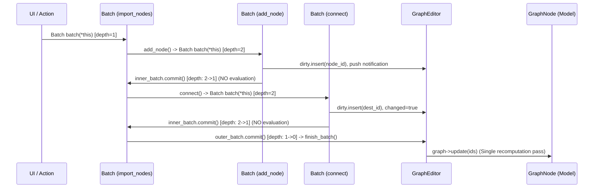

# Graph editor extraction — issue #751

The target is one owner for interactive graph edits: `GraphEditor`. `GraphNode`
keeps graph state and domain operations; `GraphNodeWidget` keeps Qt interaction,
the `GraphViewer` scene, selection, dialogs and viewers. `GraphEditorWidget`
remains the existing panel container.

The implementation is split so each increment has a small behavioral contract
and can be reviewed and merged independently. GNodeGUI changes should land in
its repository first, followed by the corresponding Hesiod dependency update.

## 1. GNodeGUI edit requests (merged)

Connection drags, Delete and Ctrl + right-click enter overridable request methods
before modifying established graph items. The requests contain stable node/port
identifiers, not graphics pointers. A selection deletion arrives as one request.
An editor can reject a replacement without losing the existing input link.

The new `erase_node` and `erase_link` methods only synchronize the scene, without
emitting the legacy model-edit notifications. Selection notifications remain
active. Existing users retain the default request implementations and legacy
signals. No global signal suppression or update-blocking flag is introduced.

Offscreen Qt regression tests exercise accepted/rejected connections, replacement,
reverse drags, invalid gestures, batch deletion, Ctrl + right-click, repeated
erasures and legacy notification counts. They use real graphics nodes and the
gesture callbacks installed by GraphViewer, plus keyboard/mouse events for
deletion. They do not yet test Hesiod model computation.

GNodeGUI PR #12 is merged. It supplies the dependency for the Hesiod extraction
below; by itself it retains the legacy behavior for existing callers.

## 2. Extract GraphEditor and move topology edits (this change)

GraphNodeWidget now owns one GraphEditor and delegates node creation/deletion,
connection/disconnection, replacement, chain insertion, paste/duplicate, import
and clear. The GNodeGUI request overrides call the editor; the old after-edit
mutation handlers and the widget's update-blocking flag are removed. The widget
supplies node presentation and completion callbacks, so it still owns dialogs,
selection, graphics widgets and viewers.

Explicitly committed, nesting-safe batches collect affected nodes and publish
completion notifications after model and scene agree. They compute once at the
outermost successful commit; their destructors restore scheduling state and never
compute during exception unwinding. GraphNode's node factory now constructs nodes
without computing them, letting initialization and connections precede the first
update. Computation failure leaves the accepted topology intact and scheduling
available for a retry.

Connections validate node/port existence, direction, type and cycles before
changing an occupied input. Duplicate links are no-ops. Failed presentation,
replacement reconnection or paste rolls back the affected topology. Replacement
keeps the original node until the new one can be displayed and reconnected;
incompatible ports are omitted and their former downstream nodes are recomputed.
Chain insertion preserves branches it cannot reconnect. Deletion removes graphics
while proxies still reference live nodes, then uses GraphNode's deletion API to
preserve Broadcast/Receive cleanup. Clear removes the model nodes as well as the
scene. Link changes now mark the project dirty through a graph-edit notification.

These batches are not general-purpose transactions: callers of the low-level batch
API must undo their own mutations when abandoning a batch. Cross-graph broadcasts
and existing direct settings/configuration update paths remain outside the editor's
batch boundary until step 4.

The Qt integration suite uses the real GraphNode, node factory and graphics scene.
It checks graph/scene node and link sets, notification and computation counts,
rejected edits, nested failures, replacement rollback, fanout insertion, pasted ID
remapping, malformed paste rollback, Broadcast cleanup, presentation-only loading,
widget gestures/duplication and drag-to-create in both directions. A context-only
application startup avoids OpenCL, service and main-window initialization in CPU
integration tests. The application and tests share an object library to avoid
compiling the application implementation twice.

Run from the repository root, with the full node set and Qt Test available:

```sh
cmake -S . -B build -DHESIOD_ENABLE_TESTS=ON
cmake --build build --target hesiod test_graph_editor
ctest --test-dir build -R '^graph_editor$' --output-on-failure
```

### Batch lifecycle and deferred evaluation

The `GraphEditor::Batch` RAII mechanism coordinates atomic edits across nested operations, decoupling graph mutations from evaluations and UI notifications:

- **Change staging**: During nested operations (e.g. importing a subgraph, replacing a node), mutations stage dirty node IDs and queue presentation events without computing or emitting UI signals.
- **Outermost commit**: When the outermost batch successfully commits, the editor dispatches deferred notifications (`created`, `deleted`, `changed`) and triggers a single topological recomputation pass over all accumulated dirty nodes.
- **Exception safety**: If a batch scope exits without committing (e.g. due to validation or connection errors), the destructor rolls back tracking state to its snapshot without triggering computation during stack unwinding.



## 3. Move the Hesiod node proxy into the GUI layer

Introduce an explicit Hesiod adapter implementing GNodeGUI's NodeProxy interface.
Move GUI port conversion and presentation responsibilities out of BaseNode. Use
GNode's port direction type in model APIs and convert it at the adapter boundary.
Give the proxy a clear owner and make identifier/lifetime behavior explicit.

BaseNode currently includes `gnodegui/node_proxy.hpp`, which includes Qt. Thus
GraphNode's header has no direct Qt include, but the model implementation is not
yet Qt-independent. Verify removal with a model-header compilation check without
Qt include paths, as well as the normal application build. Avoid changing saved
node identifiers, port IDs or captions as an incidental effect of this move.

## 4. Loading, settings and remaining update paths

Separate loading an already-built model into the view from interactive import
and paste. Rebuild graphics connections from the accepted model and preserve
layout/viewer state from the project file. Keep headless loading independent of
widgets and retain legacy port migration behavior.

Route GUI settings, configuration and reload requests through the editor's update
policy. Inventory other direct calls, including NodeAttributesWidget and special
node widgets, to complete the editor update policy. The widget blocker was removed
in step 2. Domain-driven broadcasting and headless execution remain valid model callers; the editor is the single entry
point for interactive edits, not a compulsory Qt dependency for all computation.

Finish with project round-trip, paste/import, legacy project, selection/viewer
lifetime and Broadcast/Receive regression checks. The existing editor widget API
can remain as forwarding methods during migration, then shrink once callers move.
