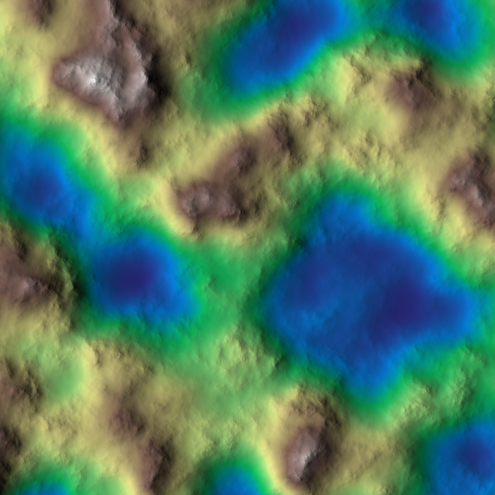
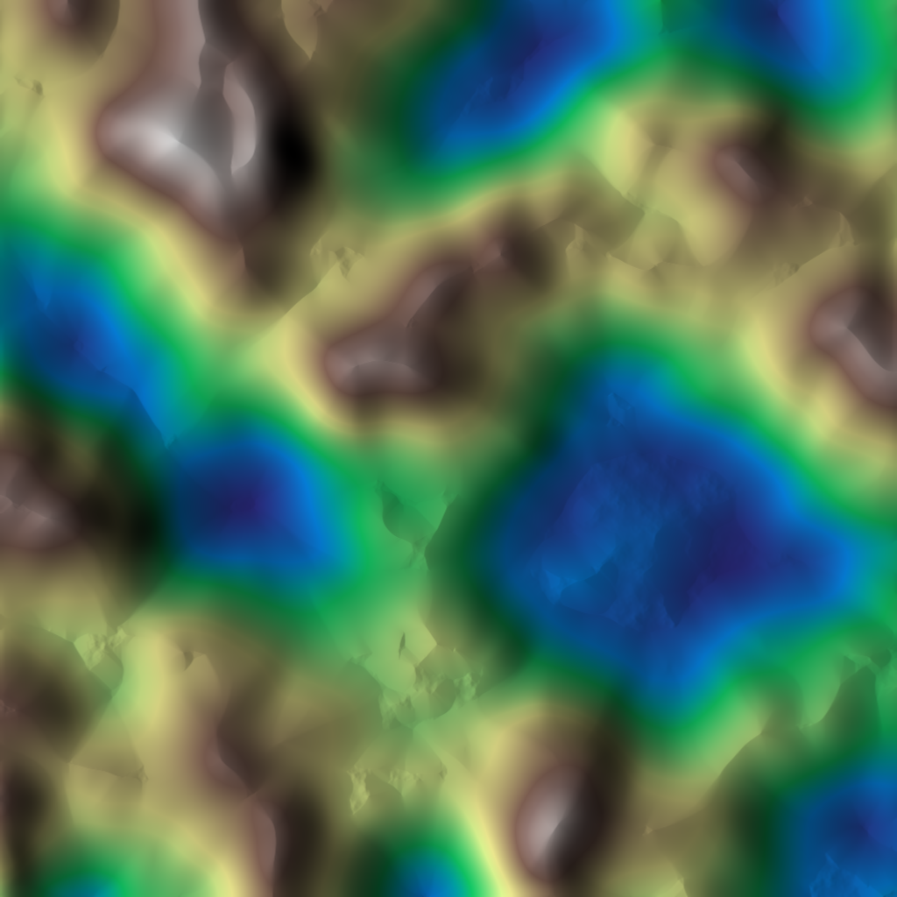
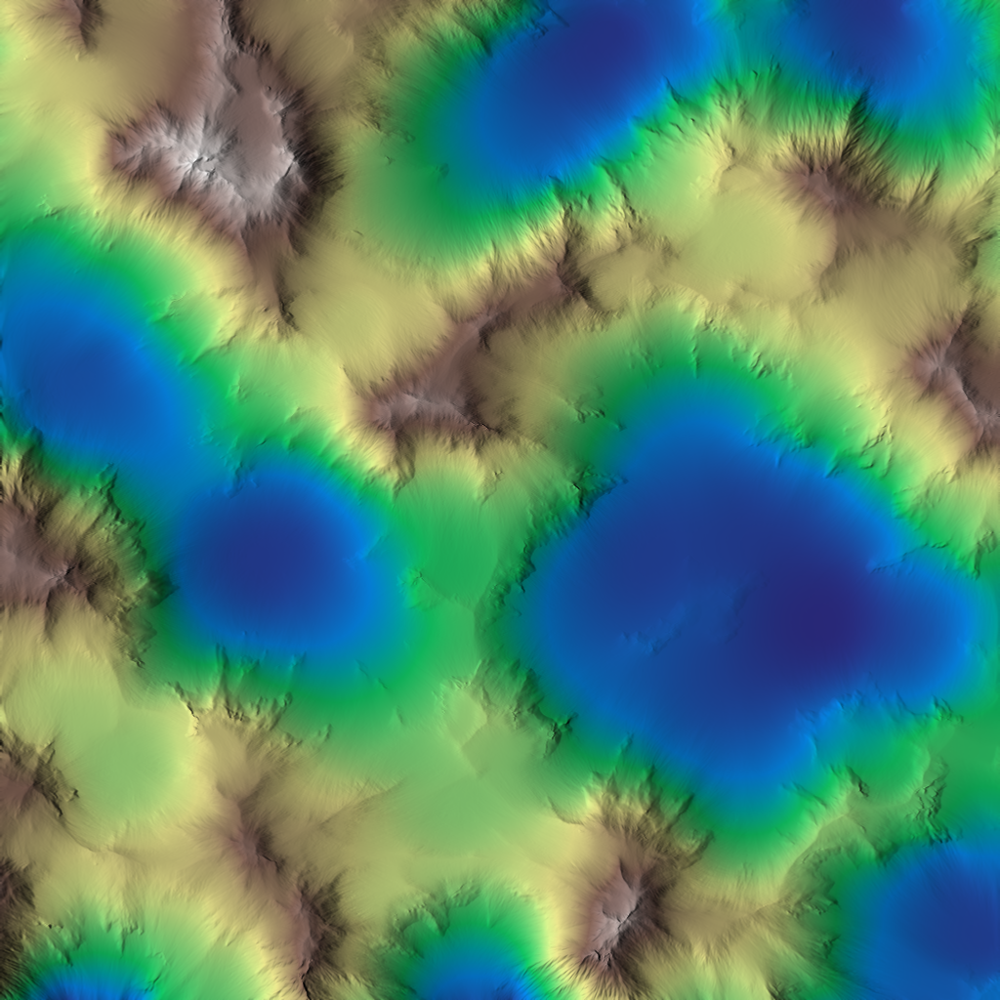

# Erosion — Thermal vs Hydraulic

Hesiod ships two families of erosion. Reach for them after you have a base
heightmap (see [Getting Started](../getting_started/index.md)).

*The base terrain these recipes start from. Source graph: [`erosion-before.hsd`](graphs/erosion-before.hsd).*

## Thermal erosion

Material slumps downhill once a slope exceeds the *angle of repose* (talus
angle): peaks soften, debris collects as scree at the base. Use it to make raw
noise read as weathered rock.

- **`Thermal`** — the workhorse; smooths slopes past a talus threshold.
- **`ThermalScree`** — accumulates scree/talus at slope bases.
- **`ThermalFlatten`** — flattens toward stable plateaus.
- **`ValleyFill`**, **`DepressionFilling`**, **`DepositionFillHoles`** —
  deposition-side cleanup (fill pits and basins).

*`NoiseFbm → Thermal`. Source graph: [`erosion-thermal.hsd`](graphs/erosion-thermal.hsd).*

## Hydraulic erosion

Simulated water flows downhill, picking up and depositing sediment: it carves
drainage channels and river valleys and lays down alluvial deposits.

- **`HydraulicParticle`** — the workhorse; particle-based water erosion.
- **`HydraulicStreamLog`** — stream-power channel carving.
- **`HydraulicSaleve`**, **`HydraulicProcedural`** — alternative hydraulic models.
- **`Rifts`** — incised rift/channel features.

*`NoiseFbm → HydraulicParticle`. Source graph: [`erosion-hydraulic.hsd`](graphs/erosion-hydraulic.hsd).*

## Choosing and combining

A common recipe is **thermal first, then hydraulic**: thermal settles slopes to
a believable repose angle, then hydraulic carves drainage into that surface.
Most erosion nodes accept a **mask** input so you can confine erosion to chosen
areas — see [Masks & Selectors](masks-selectors.md) (e.g. erode only steep
slopes with `SelectSlope`).

## Related nodes

- **Stratify** — `Strata`, `StrataCells`, `StrataPlates`, `StrataTerrace`
  (sedimentary banding/terracing).
- **Coastal** — `CoastalErosionDiffusion`, `CoastalErosionProfile`
  (shoreline erosion).

## See also

- [Heightmaps & Virtual Arrays](../core_concepts/heightmaps.md) — the data model.
- [Using Physics-Based Procedures → Hydrology](../user_manual/using_physics_based_procedures/hydrology/index.md).
