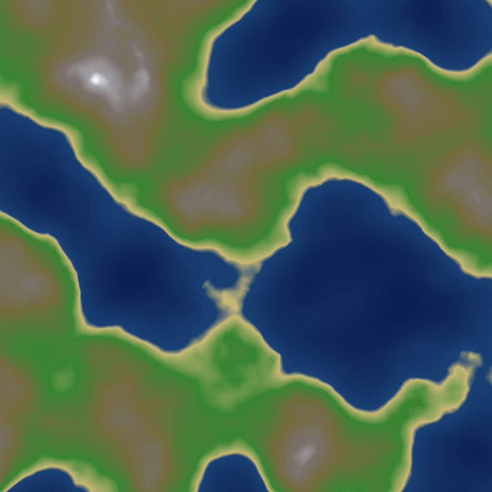
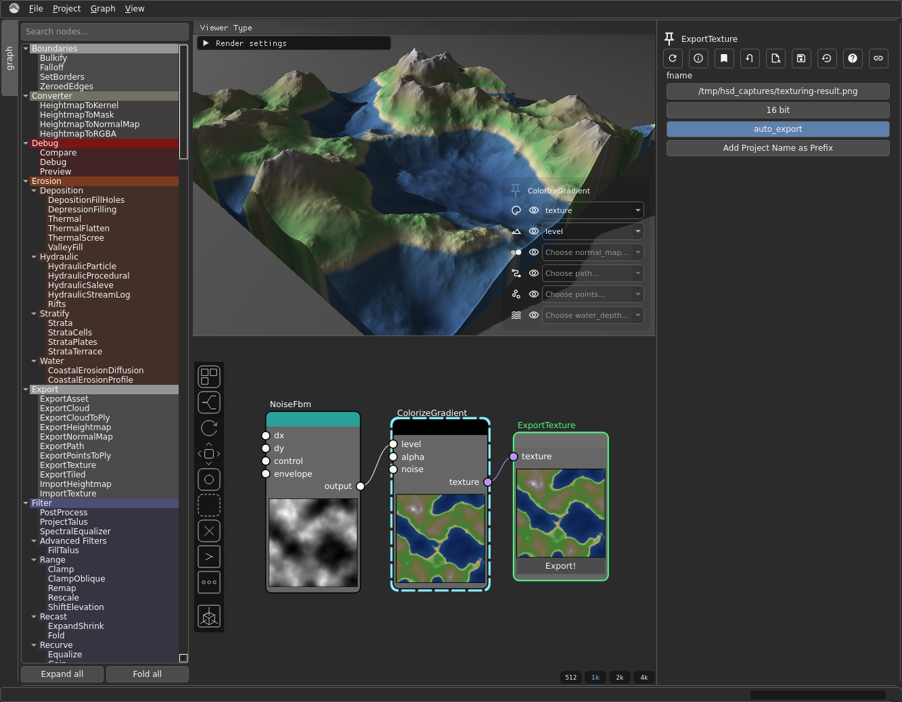

# Texturing & Colorize

Texturing turns a scalar heightmap (`VirtualArray`) into colour output
(`VirtualTexture`). The conversion happens at the colorize step, and everything
downstream lives in texture space.

*`NoiseFbm → ColorizeGradient → ExportTexture`. Source graph: [`texturing-result.hsd`](graphs/texturing-result.hsd).*

## The pipeline

1. From a heightmap, build **soil/material masks** with the for-texturing
   selectors: **`SelectSoilFlow`**, **`SelectSoilRocks`**,
   **`SelectSoilWeathered`** (see [Masks & Selectors](masks-selectors.md)).
2. **Colorize** each layer:
   - **`ColorizeGradient`** — map elevation/mask to a colour gradient.
   - **`ColorizeSolid`** — a flat colour layer.

   These take a `VirtualArray` in and output a `texture` (`VirtualTexture`).
3. **Blend** the layers:
   - **`MixTexture`** — combine colour layers (often weighted by a soil mask).
   - **`MixNormalMap`** — combine normal-map detail.
4. **Adjust**: **`ColorAdjust`** (levels/balance), **`SetAlpha`** (transparency),
   **`TextureSplitChannels`** / **`TextureSelectColor`** for channel work.
5. **Export** with **`ExportTexture`** (or `ExportNormalMap`). See
   [Export Formats](export-formats.md).

*The minimal `NoiseFbm → ColorizeGradient → ExportTexture` graph from [`texturing-result.hsd`](graphs/texturing-result.hsd), open in Hesiod.*

## Why colour can't go to ExportHeightmap

`ColorizeGradient`/`ColorizeSolid` convert `VirtualArray → VirtualTexture`. A
colourised result is no longer a heightmap, so it must go to `ExportTexture`. To
also export the raw elevation, **fork** before colorize: send the heightmap to
`ExportHeightmap` and a copy through colorize to `ExportTexture`. See
[Heightmaps & Virtual Arrays](../core_concepts/heightmaps.md).
