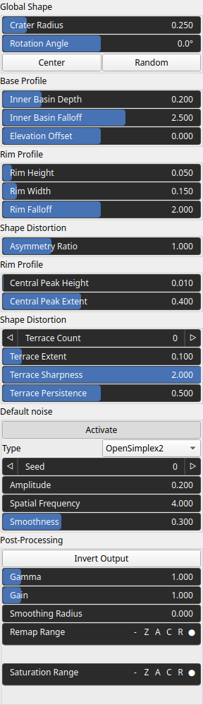

Crater Node
===========

Crater generates a crater landscape..

# Category

Primitive/Geological
# Inputs

|Name|Type|Description|
| :--- | :--- | :--- |
|envelope|VirtualArray|No description|
|noise|VirtualArray|No description|

# Outputs

|Name|Type|Description|
| :--- | :--- | :--- |
|crater_mask|VirtualArray|No description|
|output|VirtualArray|Crater heightmap.|

# Parameters

|Name|Type|Description|
| :--- | :--- | :--- |
|Rotation Angle|Float|No description|
|Asymmetry Ratio|Float|No description|
|Center|Vec2Float|Reference center within the heightmap.|
|Central Peak Extent|Float|No description|
|Central Peak Height|Float|No description|
|Activate|Bool|No description|
|Spatial Frequency|Float|No description|
|Amplitude|Float|No description|
|Type|Enumeration|No description|
|Seed|Random seed number|No description|
|Smoothness|Float|No description|
|Elevation Offset|Float|No description|
|Inner Basin Depth|Float|No description|
|Inner Basin Falloff|Float|No description|
|Rim Falloff|Float|No description|
|Rim Width|Float|No description|
|Rim Height|Float|No description|
|Terrace Count|Integer|No description|
|Gain|Float|Mid-centered gain transformation applied to the elevation values. This is a non-linear recurve operator centered around the mid elevation (typically 0.5). Increasing the gain pushes values toward the minimum and maximum elevations, creating flatter low/high regions with a steeper transition around the midpoint.|
|Gamma|Float|Standard gamma correction applied to the elevation values. This is a monotonic power-law remapping that shifts emphasis toward low or high elevations, making the overall shape sharper or bulkier without changing its ordering.|
|Invert Output|Bool|Inverts the output values after processing, flipping low and high values across the midrange.|
|Remap Range|Value range|Linearly remaps the output values to a specified target range (default is [0, 1]).|
|Saturation Range|Value range|Modifies the amplitude of elevations by first clamping them to a given interval and then scaling them so that the restricted interval matches the original input range. This enhances contrast in elevation variations while maintaining overall structure.|
|Smoothing Radius|Float|Defines the radius for post-processing smoothing, determining the size of the neighborhood used to average local values and reduce high-frequency detail. A radius of 0 disables smoothing.|
|Crater Radius|Float|Crater radius.|
|Terrace Sharpness|Float|No description|
|Terrace Extent|Float|No description|
|Terrace Persistence|Float|No description|

# Example

No example available.  
