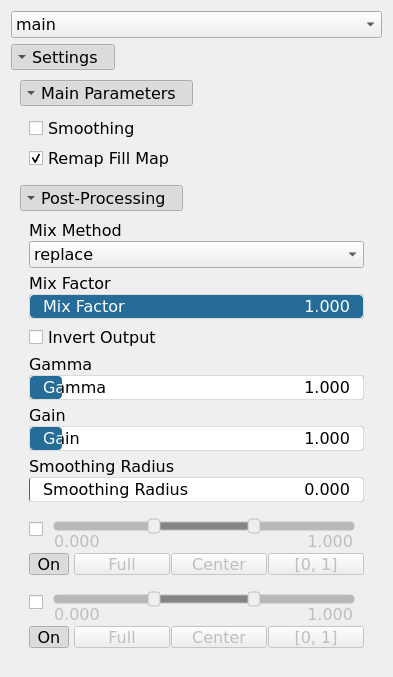
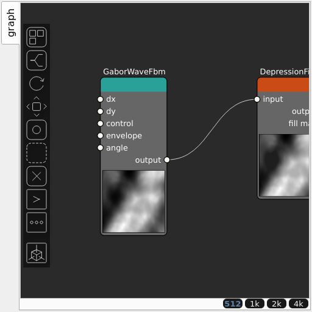

DepressionFilling Node
======================

DepressionFilling is used to fill depressions or sinks in an heightmap. It ensures that there are no depressions, i.e. areas within a digital elevation model that are surrounded by higher terrain, with no outlet to lower areas.

## Category

Erosion/Deposition
## Inputs

|Name|Type|Description|
| :--- | :--- | :--- |
|input|VirtualArray|Input heightmap.|

## Outputs

|Name|Type|Description|
| :--- | :--- | :--- |
|fill map|VirtualArray|Filling map.|
|output|VirtualArray|Filled heightmap.|

## Parameters

|Name|Type|Description|
| :--- | :--- | :--- |
|remap fill map|Bool|Remap to [0, 1] the filling map.|

## Example

Corresponding Hesiod file: [DepressionFilling.hsd](../../examples/DepressionFilling.hsd). Use [Ctrl+I] in the node editor to import a hsd file within your current project.

!!! note
    Example files are kept up-to-date with the latest version of [Hesiod](https://github.com/otto-link/Hesiod).
    If you find an error, please [open an issue](https://github.com/otto-link/Hesiod/issues).

