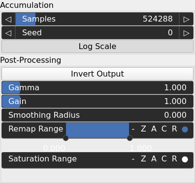
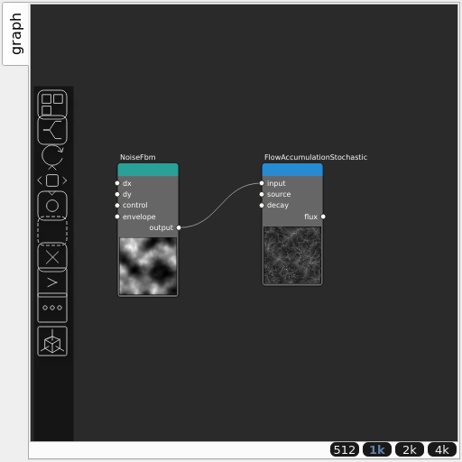

FlowAccumulationStochastic Node
===============================

Monte-Carlo (stochastic) flow accumulation. Particles are spawned uniformly, advected down the gradient with exact voxel traversal, optionally attenuated by a decay term, and deposit flux into every cell they cross. Produces a smooth, artifact-free river/water flux compared with D8 accumulation.

## Category

Hydrology
## Inputs

|Name|Type|Description|
| :--- | :--- | :--- |
|decay|VirtualArray|Optional per-cell decay rate (default: 0, pure accumulation).|
|input|VirtualArray|Input heightmap.|
|source|VirtualArray|Optional per-cell source term (default: uniform 1).|

## Outputs

|Name|Type|Description|
| :--- | :--- | :--- |
|flux|VirtualArray|Steady-state flux, usable as a river/water mask.|

## Parameters

|Name|Type|Description|
| :--- | :--- | :--- |
|Log Scale|Bool|Apply log10(flux + 1) so the orders-of-magnitude flux reads as a usable river/water mask.|
|Samples|Integer|Number of Monte-Carlo particles; higher reduces per-cell variance (~1/N).|
|Gain|Float|Mid-centered gain transformation applied to the elevation values. This is a non-linear recurve operator centered around the mid elevation (typically 0.5). Increasing the gain pushes values toward the minimum and maximum elevations, creating flatter low/high regions with a steeper transition around the midpoint.|
|Gamma|Float|Standard gamma correction applied to the elevation values. This is a monotonic power-law remapping that shifts emphasis toward low or high elevations, making the overall shape sharper or bulkier without changing its ordering.|
|Invert Output|Bool|Inverts the output values after processing, flipping low and high values across the midrange.|
|Remap Range|Value range|Linearly remaps the output values to a specified target range (default is [0, 1]).|
|Saturation Range|Value range|Modifies the amplitude of elevations by first clamping them to a given interval and then scaling them so that the restricted interval matches the original input range. This enhances contrast in elevation variations while maintaining overall structure.|
|Smoothing Radius|Float|Defines the radius for post-processing smoothing, determining the size of the neighborhood used to average local values and reduce high-frequency detail. A radius of 0 disables smoothing.|
|Seed|Random seed number|Random seed number. The random seed is an offset to the randomized process. A different seed will produce a new result.|

## Example

Corresponding Hesiod file: [FlowAccumulationStochastic.hsd](../../examples/FlowAccumulationStochastic.hsd). Use [Ctrl+I] in the node editor to import a hsd file within your current project.

!!! note
    Example files are kept up-to-date with the latest version of [Hesiod](https://github.com/otto-link/Hesiod).
    If you find an error, please [open an issue](https://github.com/otto-link/Hesiod/issues).

## Usage

The `flux` output is a smooth, artifact-free estimate of how much water passes
through each cell. With **Log Scale** enabled (the default) it compresses the
orders-of-magnitude flux into a `[0, 1]` field that can be used directly as a
river / water mask, or as a moisture input to downstream nodes.

Two optional inputs unlock non-uniform transport:

- **source** — a per-cell spawn weight. Feed a rainfall or moisture map to bias
  accumulation toward wetter regions.
- **decay** — a per-cell attenuation rate. Non-zero decay turns the pure
  accumulation into a *transport-with-loss* field (evaporating moisture,
  finite sediment settling distance, snow drift).

Because flow is globally coupled, a single tile (`tiling = 1 × 1`) produces the
most coherent basin-scale drainage; larger tilings approximate it per tile.
Raise **Samples** to reduce per-cell variance (noise falls roughly as `1 / N`).
