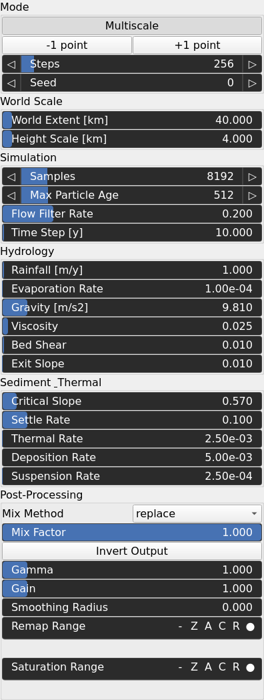
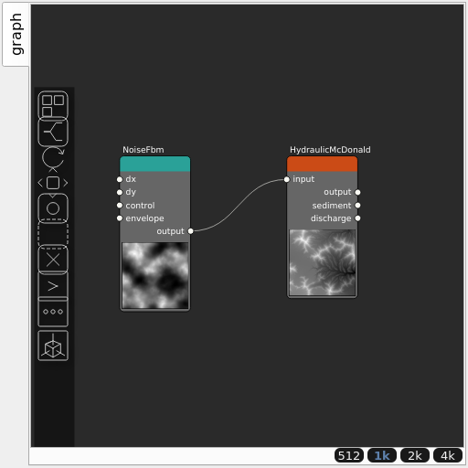

HydraulicMcDonald Node
======================

Flow-coupled particle hydraulic erosion (McDonald model, GPU only). Persistent per-cell discharge and momentum fields couple particles through the mean local flow, carving coherent drainage networks, with a bank-stability debris flow against a separate sediment layer. Physically parameterized: the terrain is a world_extent_km square with a z_scale_km height range. Single-scale diverges at high resolution past a few hundred steps; enable Multiscale for high-res terrain.

## Category

Erosion/Hydraulic
## Inputs

|Name|Type|Description|
| :--- | :--- | :--- |
|input|VirtualArray|Input bedrock heightmap.|

## Outputs

|Name|Type|Description|
| :--- | :--- | :--- |
|output|VirtualArray|Eroded surface (bedrock + sediment).|
|sediment|VirtualArray|Final sediment layer.|
|discharge|VirtualArray|Water discharge field, usable as a river/water mask.|

## Parameters

|Name|Type|Description|
| :--- | :--- | :--- |
|Multiscale|Bool|Erode on a halving-resolution ladder (coarsest first); the stable path at high resolution.|
|Steps Per Level|Vector of integers|Per-level iteration counts (coarsest first) when Multiscale is on.|
|Steps|Integer|Number of erosion iterations when Multiscale is off.|
|Seed|Random seed number|Random seed.|
|World Extent [km]|Float|Physical domain edge length [km].|
|Height Scale [km]|Float|Physical height range of the [0,1] elevation span [km].|
|Samples|Integer|Particles per iteration.|
|Max Particle Age|Integer|Maximum particle age / trajectory length.|
|Flow Filter Rate|Float|Exponential filter rate for the flow fields.|
|Time Step [y]|Float|Geological time step [y].|
|Rainfall [m/y]|Float|Rainfall rate [m/y].|
|Evaporation Rate|Float|Evaporation rate.|
|Gravity [m/s2]|Float|Gravity [m/s^2].|
|Viscosity|Float|Kinematic viscosity / flow-coupling strength.|
|Bed Shear|Float|Bed shear coefficient.|
|Exit Slope|Float|Boundary exit slope [m/m].|
|Critical Slope|Float|Critical (stable bank) slope [m/m].|
|Settle Rate|Float|Debris settling rate.|
|Thermal Rate|Float|Thermal erosion rate.|
|Deposition Rate|Float|Fluvial deposition rate.|
|Suspension Rate|Float|Fluvial suspension rate.|
|Mix Factor|Float|Mixing factor for blending input and output values. A value of 0 uses only the input, 1 uses only the output, and intermediate values perform a linear interpolation.|
|Mix Method|Enumeration|Method used to combine input and output values. Options include linear interpolation (default), min, max, smooth min, smooth max, add, and subtract.|
|Invert Output|Bool|Inverts the output values after processing, flipping low and high values across the midrange.|
|Gamma|Float|Standard gamma correction applied to the elevation values. This is a monotonic power-law remapping that shifts emphasis toward low or high elevations, making the overall shape sharper or bulkier without changing its ordering.|
|Gain|Float|Mid-centered gain transformation applied to the elevation values. This is a non-linear recurve operator centered around the mid elevation (typically 0.5). Increasing the gain pushes values toward the minimum and maximum elevations, creating flatter low/high regions with a steeper transition around the midpoint.|
|Smoothing Radius|Float|Defines the radius for post-processing smoothing, determining the size of the neighborhood used to average local values and reduce high-frequency detail. A radius of 0 disables smoothing.|
|Remap Range|Value range|Linearly remaps the output values to a specified target range (default is [0, 1]).|
|Saturation Range|Value range|Modifies the amplitude of elevations by first clamping them to a given interval and then scaling them so that the restricted interval matches the original input range. This enhances contrast in elevation variations while maintaining overall structure.|

## Example

Corresponding Hesiod file: [HydraulicMcDonald.hsd](../../examples/HydraulicMcDonald.hsd). Use [Ctrl+I] in the node editor to import a hsd file within your current project.

!!! note
    Example files are kept up-to-date with the latest version of [Hesiod](https://github.com/otto-link/Hesiod).
    If you find an error, please [open an issue](https://github.com/otto-link/Hesiod/issues).

## Usage

`HydraulicMcDonald` is a GPU-only, flow-coupled particle erosion model. Unlike
the other hydraulic operators it is *physically* parameterized: the heightmap is
interpreted as a **World Extent** × **World Extent** km domain whose `[0, 1]`
elevation span maps to **Height Scale** km. The defaults describe a 40 × 40 km
region with 4 km of relief; change these to keep behaviour consistent when you
change resolution.

Keep **Multiscale** enabled for anything above ~512 px. Single-scale erosion is
numerically unstable and diverges after a few hundred steps at 1024² and above;
the multiscale schedule (`Steps Per Level`, coarsest first) erodes on a halving
resolution ladder and is the stable path to high-resolution terrain.

Outputs:

- **output** — the eroded surface (bedrock + deposited sediment).
- **sediment** — the final sediment layer, useful as a deposition mask.
- **discharge** — the water discharge field, usable directly as a river / water
  mask.

The model couples particles through a shared flow field, so a single tile
(`tiling = 1 × 1`) yields the most coherent drainage network; tiled runs erode
each tile as its own scaled world and stitch the elevations at the seams.
