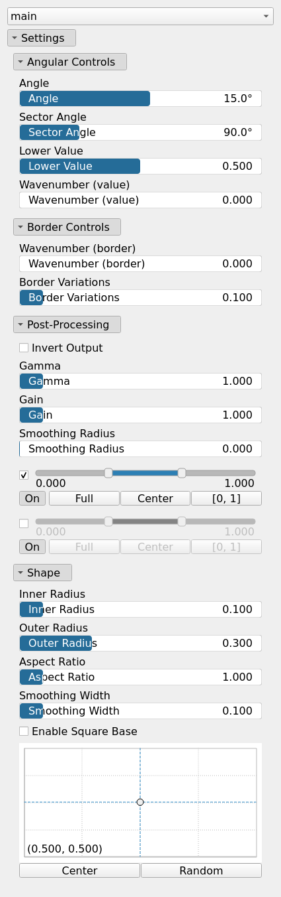
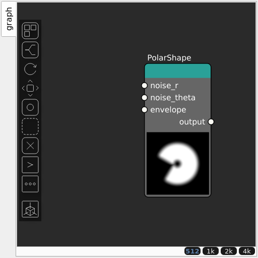

PolarShape Node
===============

No description available

## Category

Primitive/Function
## Inputs

|Name|Type|Description|
| :--- | :--- | :--- |
|envelope|VirtualArray|No description|
|noise_r|VirtualArray|No description|
|noise_theta|VirtualArray|No description|

## Outputs

|Name|Type|Description|
| :--- | :--- | :--- |
|output|VirtualArray|No description|

## Parameters

|Name|Type|Description|
| :--- | :--- | :--- |
|Angle|Float|No description|
|Aspect Ratio|Float|No description|
|Center|Vec2Float|No description|
|Wavenumber (border)|Float|No description|
|Border Variations|Float|No description|
|Wavenumber (value)|Float|No description|
|Gain|Float|No description|
|Gamma|Float|No description|
|Invert Output|Bool|No description|
|Remap Range|Value range|No description|
|Saturation Range|Value range|No description|
|Smoothing Radius|Float|No description|
|Outer Radius|Float|No description|
|Inner Radius|Float|No description|
|Sector Angle|Float|No description|
|Smoothing Width|Float|No description|
|Enable Square Base|Bool|No description|
|Lower Value|Float|No description|

## Example

Corresponding Hesiod file: [PolarShape.hsd](../../examples/PolarShape.hsd). Use [Ctrl+I] in the node editor to import a hsd file within your current project.

!!! note
    Example files are kept up-to-date with the latest version of [Hesiod](https://github.com/otto-link/Hesiod).
    If you find an error, please [open an issue](https://github.com/otto-link/Hesiod/issues).

