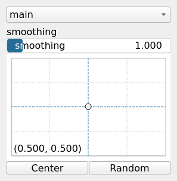

RadialDisplacementToXy Node
===========================

RadialDisplacementToXy interprets the input array dr as a radial displacement and convert it to a pair of displacements dx and dy in cartesian coordinates.

## Category

Math
## Inputs

|Name|Type|Description|
| :--- | :--- | :--- |
|dr|VirtualArray|Radial displacement.|

## Outputs

|Name|Type|Description|
| :--- | :--- | :--- |
|dx|VirtualArray|Displacement with respect to the domain size (x-direction).|
|dy|VirtualArray|Displacement with respect to the domain size (y-direction).|

## Parameters

|Name|Type|Description|
| :--- | :--- | :--- |
|center|Vec2Float|Reference center within the heightmap. Coordinates are in domain units; center.y is measured from the bottom of the map (y increases upward).|
|smoothing|Float|Smoothing parameter to avoid discontinuity at the origin.|

## Example

!!! note "No example yet"
    No example available for this node.  
