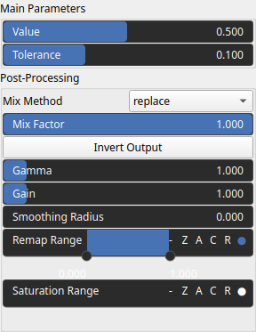
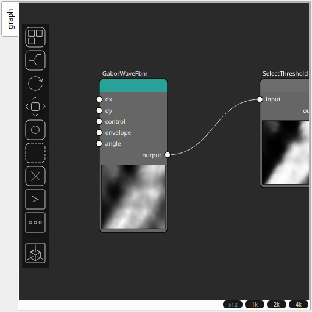

SelectThreshold Node
====================

No description available

## Category

Terrain Features/Selector
## Inputs

|Name|Type|Description|
| :--- | :--- | :--- |
|input|VirtualArray|No description|

## Outputs

|Name|Type|Description|
| :--- | :--- | :--- |
|output|VirtualArray|No description|

## Parameters

|Name|Type|Description|
| :--- | :--- | :--- |
|Gain|Float|No description|
|Gamma|Float|No description|
|Invert Output|Bool|No description|
|Mix Factor|Float|No description|
|Mix Method|Enumeration|No description|
|Remap Range|Value range|No description|
|Saturation Range|Value range|No description|
|Smoothing Radius|Float|No description|
|Tolerance|Float|No description|
|Value|Float|No description|

## Example

Corresponding Hesiod file: [SelectThreshold.hsd](../../examples/SelectThreshold.hsd). Use [Ctrl+I] in the node editor to import a hsd file within your current project.

!!! note
    Example files are kept up-to-date with the latest version of [Hesiod](https://github.com/otto-link/Hesiod).
    If you find an error, please [open an issue](https://github.com/otto-link/Hesiod/issues).

  
