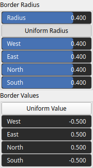

SetBorders Node
===============

TODO

## Category

Boundaries
## Inputs

|Name|Type|Description|
| :--- | :--- | :--- |
|input|VirtualArray|TODO|

## Outputs

|Name|Type|Description|
| :--- | :--- | :--- |
|output|VirtualArray|TODO|

## Parameters

|Name|Type|Description|
| :--- | :--- | :--- |
|Radius|Float|TODO|
|East|Float|East-edge buffer thickness (fraction of width).|
|North|Float|North (top) edge buffer thickness (fraction of height).|
|South|Float|South (bottom) edge buffer thickness (fraction of height).|
|West|Float|West-edge buffer thickness (fraction of width).|
|Uniform Radius|Bool|No description|
|Uniform Value|Bool|No description|
|East|Float|TODO|
|North|Float|TODO|
|South|Float|TODO|
|West|Float|TODO|

## Example

!!! note "No example yet"
    No example available for this node.  
