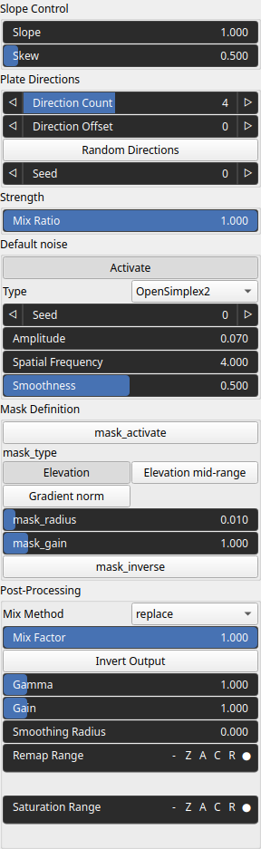

StrataPlates Node
=================

No description available

# Category

Erosion/Stratify
# Inputs

|Name|Type|Description|
| :--- | :--- | :--- |
|dx|VirtualArray|No description|
|dy|VirtualArray|No description|
|input|VirtualArray|No description|
|mask|VirtualArray|No description|

# Outputs

|Name|Type|Description|
| :--- | :--- | :--- |
|output|VirtualArray|No description|

# Parameters

|Name|Type|Description|
| :--- | :--- | :--- |
|Direction Count|Integer|No description|
|Direction Offset|Integer|No description|
|Activate|Bool|No description|
|Spatial Frequency|Float|No description|
|Amplitude|Float|No description|
|Type|Enumeration|No description|
|Seed|Random seed number|No description|
|Smoothness|Float|No description|
|mask_activate|Bool|No description|
|mask_gain|Float|No description|
|mask_inverse|Bool|No description|
|mask_radius|Float|No description|
|mask_type|Choice|No description|
|Mix Ratio|Float|No description|
|Gain|Float|No description|
|Gamma|Float|No description|
|Invert Output|Bool|No description|
|Mix Factor|Float|No description|
|Mix Method|Enumeration|No description|
|Remap Range|Value range|No description|
|Saturation Range|Value range|No description|
|Smoothing Radius|Float|No description|
|Random Directions|Bool|No description|
|Seed|Random seed number|No description|
|Skew|Float|No description|
|Slope|Float|No description|

# Example

No example available.