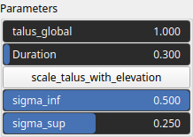

ThermalFlatten Node
===================

TODO

## Category

Erosion/Deposition
## Inputs

|Name|Type|Description|
| :--- | :--- | :--- |
|input|VirtualArray|TODO|
|mask|VirtualArray|No description|

## Outputs

|Name|Type|Description|
| :--- | :--- | :--- |
|output|VirtualArray|TODO|

## Parameters

|Name|Type|Description|
| :--- | :--- | :--- |
|Duration|Float|No description|
|scale_talus_with_elevation|Bool|Scales the talus amplitude based on heightmap elevation, reducing it at lower elevations and maintaining the nominal value at higher elevations.|
|sigma_inf|Float|No description|
|sigma_sup|Float|No description|
|talus_global|Float|TODO|

## Example

!!! note "No example yet"
    No example available for this node.  
